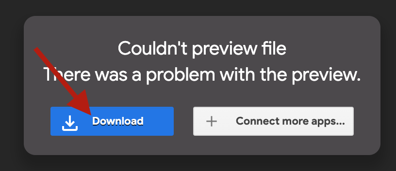

# YOLOv7 Transfer Learning Tutorial
**A tutorial on how to transfer learn the YOLOv7 model on a new labeled dataset. It will also show you how to preprocess the data to meet the proper format to be trained.**

## Citations
- **[YOLOv7](https://github.com/WongKinYiu/yolov7) made all of this possible.**
- **[DOTA Dataset](https://captain-whu.github.io/DOTA/dataset.html) used for training the new model.**
- **Thank you [JJ Jordan](https://www.pexels.com/@see2believe/) for the royalty free test image! (data/test-image.jpg)**

## Prerequisites
- [Conda](https://www.anaconda.com/products/distribution) is installed on your machine
- If you are using GPU's to train (which is highly recommended) then ensure [cuda](https://developer.nvidia.com/cuda-toolkit) is configured properly

## Getting Started
1. Create the conda environment
    - `conda create --name "yolov7-tutorial" python=3.6.9`
2. Activate the conda envrinment
    - `conda activate yolov7-tutorial`
    - **NOTE:** you will need to do this every time you run a new terminal session
3. Install the required pip packages
    - `pip install -r requirements.txt`
4. Verify that YOLOv7 is working properly ()
    - `./scripts/test_yolo_image_detection.sh`
        - The response should look something like this `The image with the result is saved in: runs/detect/expX/test-image.jpg`
        - You can open that result and you should see a bounding box or two in the image showing detections (it will be in yolov7/runs/... like what's listed above)
    - **Optionally** if you are on Mac or have a camera connected to your machine you can run the following to test video
        - `./scripts/test_yolo_video_detection.sh `
        - **NOTE:** you may have to accept the request to access the camera and run the command a second time
        - You can exit by hitting `ctrl+c` a couple times in the terminal window

## Dataset preprocessing tutorial
**In this example we will be downloading the DOTA dataset and preprocessing it into the proper format for model training**
1. Download the dataset from the Google Drive links below (these are from the official dataset release found [here](https://captain-whu.github.io/DOTA/dataset.html))
    - Images (3 zip files) click the center download button
        - [Part 1](https://drive.google.com/file/d/1BlaGYNNEKGmT6OjZjsJ8HoUYrTTmFcO2/view)
        - [Part 2](https://drive.google.com/file/d/1JBWCHdyZOd9ULX0ng5C9haAt3FMPXa3v/view)
        - [Part 3](https://drive.google.com/file/d/1pEmwJtugIWhiwgBqOtplNUtTG2T454zn/view)

    

    - Labels
        - [Label Download Link](https://drive.google.com/file/d/1I-faCP-DOxf6mxcjUTc8mYVPqUgSQxx6/view)

    

2. Create the data directory for your labeled data and move all the files into the right place
    - Make the right directory structure
        - `mkdir -p data/DOTA/labels`
    - Copy the data to the right place (depends on where you downloaded the files to)
        - `mv ~/Downloads/part* data/DOTA`
        - `mv ~/Downloads/labelTxt.zip data/DOTA/labels`
    - Unzip the labels into the labels folder and remove the zip file
        - `cd data/DOTA/labels`
        - `unzip labelTxt.zip`
        - `rm labelTxt.zip`
    - Unzip the images into the images folder and remove the zip files
        - `cd ..`
        - `unzip part1.zip`
        - `unzip part2.zip`
        - `unzip part3.zip`
        - `rm part*`
    - Make the scripts folder for our preprocessing scripts and move the example scripts over
        - `cp -r ../../scripts/example-dota-scripts scripts`

3. Preprocess the data
    - Run the preprocess script
        - `python preprocess.py`
        - There's a lot going on here so I'll explain the important parts below
        - The following code block explains how the DOTA data is labeled
            - There are 2 useless lines of metadata at the top of each file which we throw out
                - These are removed in the more up to date DOTA dataset (V2)
            - You have 4 x and y values that represent the 4 corners of a bounding box
            - This box can be in any orientation (this is important for later)
            - The class is an integer which can be mapped to the list of classes at the top of the file
            - There is also a flag determining whether the image is "difficult" or not
                - This is just if you only want to train on easier data for the model
        ```
            # creates a list of detection dicts from a given text file relative path
            def read_dota_label_file(label_file_name:str) -> list:
                # list of detection dicts
                detections = []

                # open the file
                with open(label_file_name) as dota_label_file:
                    # read each line
                    for line in dota_label_file:

                        detection = {}
                        
                        # get a list of values by spliting on white space
                        values = line.split()

                        # drop any data that isn't strictly bounding boxes
                        if len(values) != 10:
                            continue
                        
                        # set each detection dict field
                        detection['x1'] = values[0]
                        detection['y1'] = values[1]
                        detection['x2'] = values[2]
                        detection['y2'] = values[3]
                        detection['x3'] = values[4]
                        detection['y3'] = values[5]
                        detection['x4'] = values[6]
                        detection['y4'] = values[7]
                        detection['class'] = values[8]
                        # True or False if 1 or 0 respectively
                        detection['difficult'] = (values[9] == '1')
                        
                        # add the detection to the list
                        detections.append(detection)
                        
                # return the list of detection dicts
                return detections
        ```
        - This next section just gives us the dimensions of the image, why we need this will also be explained later
        ```
            # get the dimenesions from the corresponding image file
            image_file = label_file.replace(DOTA_LABEL_DIR, DOTA_IMAGE_DIR).replace('.txt', '.png')
            image_width, image_height = get_image_dimensions(image_file)

            # reads an image file and gets the dimensions of the image
            #   returns the tuple (width, height)
            def get_image_dimensions(image_file_name: str) -> tuple:
                image = Image.open(image_file_name)
                return image.size
        ```
        - This is the most important part of our preprocess script
            - Here we convert the DOTA labels into the proper format for YOLO
            - As noted before DOTA stores the points as 4 corners for a box that can be in any orientation
                - YOLO wants all the boxes to be perpendicular to the x and y axes
                    - We accomplish this by taking the highest and lowest x and y values and reorienting the box to have a top left corner of (x_low, y_low) and a bottom right corner of (x_high, y_high)
                - YOLO wants the image coordinates to be percentages of the image instead of pixel indexes
                    - We solve this by dividing each x and y value by the width or height respectively
                - YOLO also wants the boxes in terms of a center point with a height and a width
                    - This is now a simple calculation from our upper right and bottom left corner
                        - center_x = x_high + x_low / 2
                        - center_y = y_high + y_low / 2
                        - height = y_high - y_low
                        - width = x_high - x_low
        ```
            # formats a list of detections to yolov5 standards
            #   this means 5 values in the following order
            #    class(as int) center_x center_y height width
            def format_detections(detections: list, image_height: int, image_width: int) -> list:
                # list to hold formatted detections
                formatted_detections = []
                
                # loop through each detection
                for detection in detections:
                    formatted_detection = {}
                    
                    # set class value
                    formatted_detection['class'] = DETECTION_CLASS_MAPPING[detection['class']]
                    
                    # find min and max x
                    max_x = float(detection['x1'])
                    min_x = float(detection['x1'])
                    
                    # for x2-x4 check if it's the max or min
                    for i in range(2,5):
                        x_val = f"x{i}"
                        if float(detection[x_val]) > max_x:
                            max_x = float(detection[x_val])
                        elif float(detection[x_val]) < min_x:
                            min_x = float(detection[x_val])
                    
                    # find min and max y
                    max_y = float(detection['y1'])
                    min_y = float(detection['y1'])
                    
                    # for x2-x4 check if it's the max or min
                    for i in range(2,5):
                        y_val = f"y{i}"
                        if float(detection[y_val]) > max_y:
                            max_y = float(detection[y_val])
                        elif float(detection[y_val]) < min_y:
                            min_y = float(detection[y_val])
                            
                    # convert to percentages find the center, height, and with of the bbox      
                    percent_min_x = min_x / image_width
                    percent_max_x = max_x / image_width
                    percent_min_y = min_y / image_height
                    percent_max_y = max_y / image_height
                    
                    formatted_detection['center_x'] = (percent_min_x + percent_max_x) / 2
                    formatted_detection['center_y'] = (percent_min_y + percent_max_y) / 2
                    formatted_detection['width'] = percent_max_x - percent_min_x
                    formatted_detection['height'] = percent_max_y - percent_min_y
                    
                    # append detection to list of detections
                    formatted_detections.append(formatted_detection)
                    
                # return the list
                return formatted_detections
        ```
        - Now we have some code to save the detection to our new label file in the correct formatting for YOLO to be able to read it
        ```
            # saves yolo formatted detections to a file
            def save_detections(file_name: str, detections: list) -> None:
                with open(file_name, 'a') as output_file:
                    for detection in detections:
                        print(f"{detection['class']} {detection['center_x']} {detection['center_y']} {detection['height']} {detection['width']}", file=output_file)
            
        ```
        - And finally we split the data into train, test and validation sets
        ```
            # Split the dataset into train-valid-test splits 
            train_images, validation_images, train_labels, validation_labels = train_test_split(images, labels, test_size = 0.2, random_state = 1)
            validation_images, test_images, validation_labels, test_labels = train_test_split(validation_images, validation_labels, test_size = 0.5, random_state = 1)

        ```
    - Now we can verify that our new data is correctly processed by running the draw_one script
        -  `python draw_one.py`
            - This will pick a random image and draw it with the new YOLO labels
            - You should see that all the boxes are now perpendicular to the x and y axes
            - It will also print out the label information in the proper format to the terminal
    - Preprocessing is now complete!

    4. Training the model
    5. Verifying the model works


## Troubleshooting
- "I'm getting some miscellaneous python error referring to a missing library."
    1. Ensure that you have activated your conda environment
        -   `conda activate yolov7-tutorial`
    2. Verify that pip and python are actually referencing the conda versions
        -   `which python` and `which pip` should both resolve to something like `PATH_TO_HOME/opt/anaconda3/envs/yolov7-tutorial/bin/python`
            - If this isn't the case you probably have something in `.bashrc` that is hard coding the path of these binaries
            - See if `which python3` or `which pip3` resolves to the anaconda path above, if so just replace commands above with those
    3. If it's a cuda/Nvidia error make sure nvidia drivers are up to date and cuda is installed
        - `nvidia-smi` should list your graphics card(s)
            - if not check [here](https://hasindu2008.github.io/f5c/docs/cuda-troubleshoot) to see if any of these suggestions fix your issue
- "I'm trying to use a different model from the tiny model, but I'm getting an error when it tries to download a different sized model with detect.py."
    - There's some sort of git repo verification that needs to happen for the model to be downloaded
    - The best route is to just clone the yolov7 repo directly and run the detect command there
        - This should save the model to a file with the same name, and you can copy that into the models directory of this repo
        - **Note:** I know this is annoying and needs to be fixed, I have a **TODO** to investigate a better option